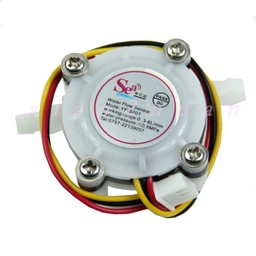

# STM32f030_max1637_timer_ic


``` cpp
the counter of time of impulses, based on capture of the timer.

as the example is used for measurement of a stream of liquid


```

* `image1`: the sensor of a stream is bought on aliexpress for $2.5


